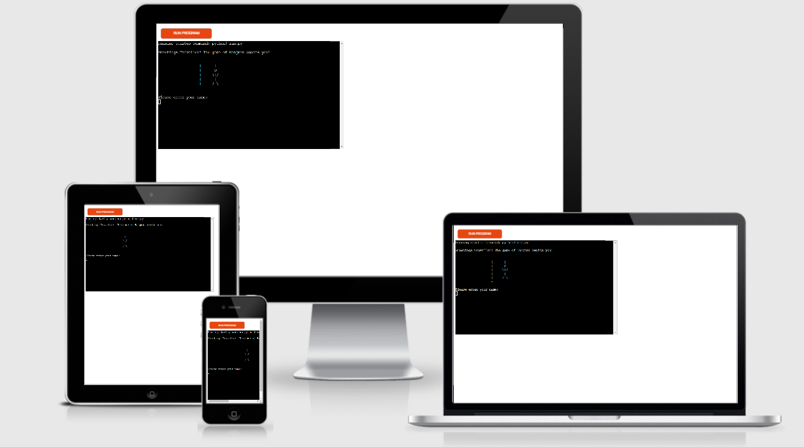
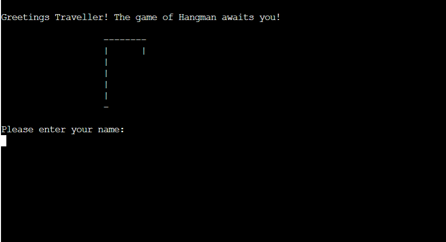
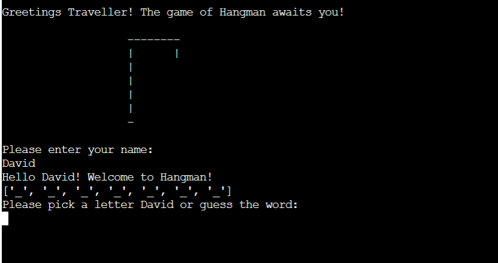
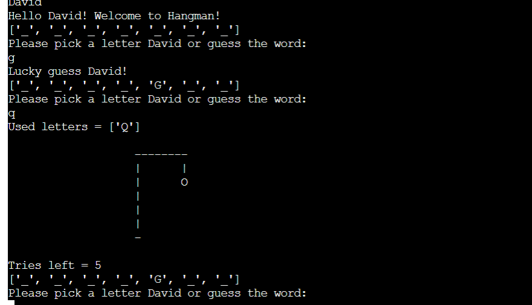
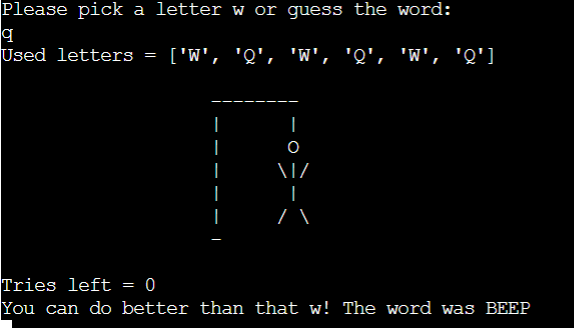

# Hangman
  Hangman is a Python terminal game, which runs in the Code Institute mock terminal on Heroku.
  
  Users will try to guess the word by inputting letters(or guessing the word).

# How to play
Hangman is a classic Guess the Word game. [Click here to find out more](https://en.wikipedia.org/wiki/Hangman_(game))

The game will atomatically generate a word, which will be visible as ("_") and the user has 6 lives to guess the word. they will do so y inputting letters or guess the word.

# Features
## Existing Features
* Welcome screen
* Allows user to enter name

* User name will be used throughout the game
* Allows multiple user inputs

* Shows user the letters/ words they have guessed
* Hangman structure updates if they get a letter/word wrong.
* Shows the user how many tries they have left
* Shows the user which letter has been correctly guessed
* Updates the word when user correctly guesses word/letter

* Confirms to the user when they have correctly guessed all letters or if they have ran out of tries and tells the user what the word was.

*Added the abilty for the user to play again after they have finished.

# Testing
I have manually tested the following:

* Passed the code through a PEP8 linter and confirmed there are no problems
* Tested in my local terminal and the Code Institute Heroku terminal
* Let multiple people try to play on different devices and give feedback on any issues/improvements

# Bugs
Had an issue when an error occured during the game. The issue was if a letter or used letter was used that you had to click return to get back to the game. So added a statement so the user understood what to do.

# Validator Testing
* No errors were returned from PEP8online.com

# Deployment
This project was deployed using Code Institute's mock terminal for Heroku.

* Steps for Deployment:
  * Fork or clone this repository
  * Create a new Heroku app
  * Set the buildbacks to Pyhton and NodeJS in that order
  * Link the Heroku app to repository
  * Click on Deploy

# Credits
* Code Institute for the deployment terminal
* Stackoverview
* Wikipedia for the details of the Hangman game
